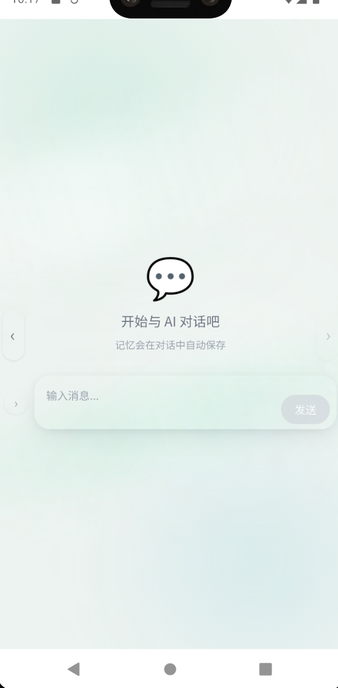
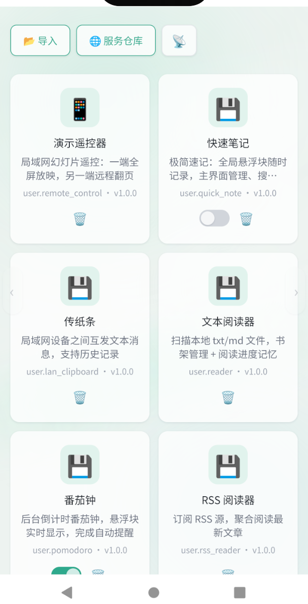
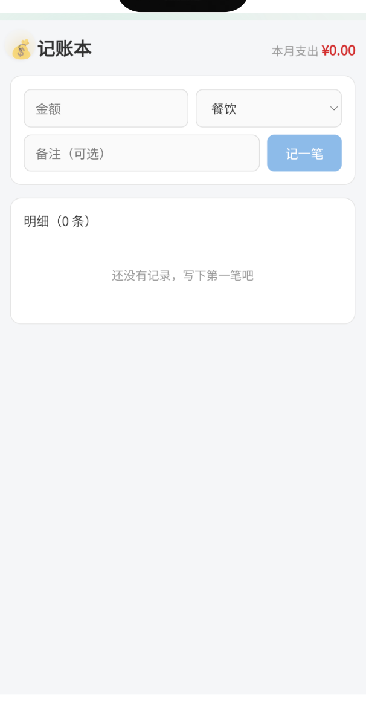
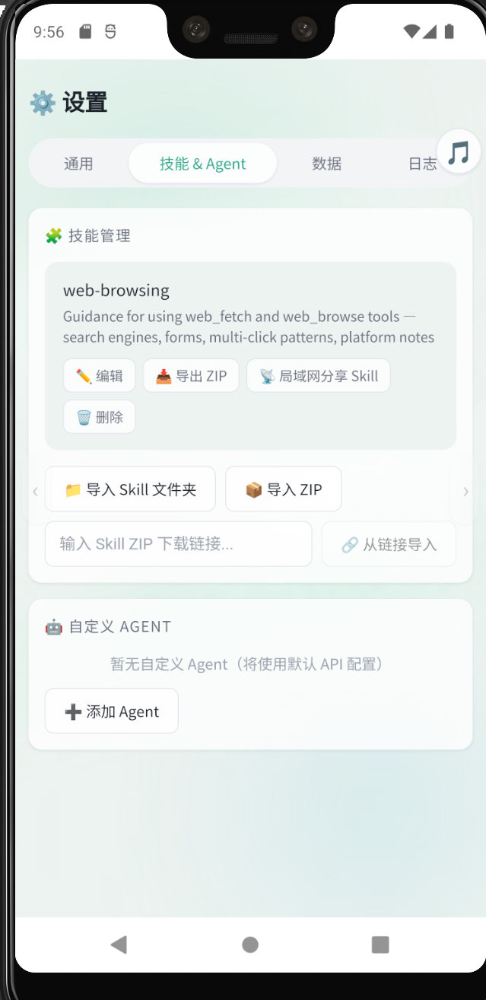

<p align="center">
  
</p>

<h1 align="center">Amiba (变形虫)</h1>

<p align="center">AI-powered cross-platform instant-app platform. Describe your needs in natural language — AI generates mini-apps that run instantly in iframe sandboxes.</p>

<p align="center">
  <a href="./LICENSE"></a>
  <a href="https://vuejs.org"></a>
  <a href="https://www.typescriptlang.org"></a>
  <a href="https://tauri.app"></a>
  <a href="https://github.com/belowthetree/amiba/actions/workflows/release.yml"></a>
  <a href="https://github.com/belowthetree/amiba/actions/workflows/release-apk.yml"></a>
</p>

<p align="center"><a href="./README.md">中文</a></p>

## Screenshots

<table align="center">
  <tr>
    <td></td>
    <td></td>
    <td></td>
    <td></td>
  </tr>
  <tr>
    <td align="center">AI Chat</td>
    <td align="center">Services</td>
    <td align="center">Service Runtime</td>
    <td align="center">Settings</td>
  </tr>
</table>

## Tech Stack

Vue 3 + TypeScript + Vite + Tauri 2 (Windows / macOS / Linux / Android)

## Quick Start

```bash
npm install
npm run dev           # Dev → http://localhost:8484
npm run build         # Production build
cargo tauri dev       # Tauri desktop (dev)
cargo tauri build     # Tauri desktop (package EXE/DMG/deb)
```

## Core Features

### AI Chat
- OpenAI-compatible multi-turn streaming chat (DeepSeek / Qwen / GLM etc.)
- **Memory System**: AI auto-saves user preferences & key info to MEMORY.md / USER.md
- **Personality System**: first-launch onboarding creates AI persona; adjustable via `soul_save` tool
- **Multi-Session**: tap › next to the input bar to open the action panel, 🗂️ session list to switch history; each session stored independently
- **Requirement Tracking**: AI records service feature requests & optimization notes

### UI & Interaction
- **No top bar**: swipe left/right to switch pages (iPhone-style follow-finger gesture), or tap the subtle glass edge arrows
- **Jade glass style**: jade-green primary + translucent glass surfaces + global glow background with light streaks
- **Floating input bar**: vertically centered when there's no chat history, sinks to the bottom once the conversation starts

### Android Home-Screen Cards (AppWidget)
- Services can ship **system home-screen cards**: a `desktop-widgets/{cardId}/` directory (widget.json UI config + logic.js data logic + assets images), rendered natively via RemoteViews
- **Global cards** are also supported: just tell the AI "put an xx card on my home screen" — no full service needed
- Long-press the Android launcher, add the "Amiba" widget and pick a card; cards refresh on a schedule and tap through to the service page

### Service Generation
- Natural language → complete HTML/CSS/JS mini-app
- Apps run in iframe sandbox; JSBridge (`window.__amiba__`) provides host capabilities (see "Service API" below)
- Service UIs follow the unified jade glass style: include `/libs/jade.css` to reuse design tokens & component classes (see [Service Style Guide](public/docs/service-style.md))
- Chart.js v4 support
- Post-generation editing via AI (`service_file_*` tools)

### Skill Evolution
- Agent **autonomously creates/patches skills**: complex successes or overcome errors → recorded as SKILL.md
- **Usage telemetry**: per-skill use/view/patch counters
- **Curator**: auto-marks unused skills stale → archived; optional LLM consolidation

### Offline-first
- All data stored locally under `{AppData}/amiba/`
- Config, memory, history, services, skills, souls — all local

### UI Customization & Multi-Theme
- **CSS variable system**: 30 `:root` variables drive the global look; AI can tweak colors/corners/fonts/shadows via chat
- **Built-in themes**: ships with `default` (jade glass), `dark` (dark mode), `ocean` (blue palette)
- **Theme management**: AI manages themes via `ui_theme_*` tools; Settings page offers dropdown switching
- **Slot system**: 4 predefined UI injection points (above chat messages, below chat input, end of Settings, above service list); AI can insert custom HTML
- **Fully AI-driven**: say "make the background dark" or "add a shortcut hint below the input bar" — AI does it

## Built-in Pages & Services

### Built-in Pages (7 routes)

The first 6 pages can be switched by swiping or tapping the edge arrows (left-to-right as listed):

| Route | Page | Description |
|---|---|---|
| `/registry` | Remote Registry | Browse/import services from remote registries |
| `/services` | Services | Installed services, import & share |
| `/` | AI Chat | Multi-turn conversation with AI |
| `/quick` | Quick Page | Customizable quick page (widget host) |
| `/settings` | Settings | Configuration (API key, providers, agents, themes, logs) |
| `/memory` | Memory | View/edit MEMORY.md & USER.md |
| `/service/:id` | Service Container | Runs services in an iframe sandbox (floating back button top-left) |

### User Prebuilt Services (`user.*`)

3 prebuilt services are auto-installed on first launch, demonstrating JSBridge modules in real-world use cases. More can be installed from remote service registries.

| ID | Name | Description | APIs Used |
|---|---|---|---|
| `user.music_player` | Music Player | Local music scanner & player with shuffle/repeat, background play, floating widget | `storage` `notification` `widgets` `background` `fileAccess` |
| `user.quick_note` | Quick Note | Global floating widget for instant notes; manage & search in main view | `storage` `notification` `widgets` |
| `user.rss_reader` | RSS Reader | Subscribe to RSS feeds, aggregate & read articles | `storage` `notification` `fetch` |

## Service API (JSBridge)

Generated services run inside `<iframe sandbox>` and call host capabilities via the `window.__amiba__` global object. Each API method requires the corresponding permission declared in the service manifest.

| Module | Permission | Description |
|--------|-----------|-------------|
| `storage` | `storage` | Per-service key-value storage |
| `notification` | `notification` | Toast notifications |
| `ui` | — | Page navigation |
| `widgets` | `widgets` | Floating widget management |
| `network` | `network` | LAN/BLE device discovery & P2P messaging |
| `desktopWidget` | `desktopWidgets` | Android home-screen card data publishing (card logic.js sandbox only) |

### storage — Key-Value Store

Each service has its own isolated key-value namespace, persisted to disk.

```js
await __amiba__.storage.set('count', 42)
const count = await __amiba__.storage.get('count')
await __amiba__.storage.remove('count')
```

| Method | Parameters | Returns |
|--------|-----------|---------|
| `set(key, data)` | `key: string, data: any` | `Promise<void>` |
| `get(key)` | `key: string` | `Promise<any>` |
| `remove(key)` | `key: string` | `Promise<void>` |

### notification — Toast

```js
await __amiba__.showToast('Saved successfully', 'success')
```

| Method | Parameters | Returns |
|--------|-----------|---------|
| `showToast(title, icon?)` | `title: string, icon?: 'success' \| 'error' \| 'loading' \| 'none'` | `Promise<void>` |

### ui — Navigation

```js
await __amiba__.navigateTo('/services')
await __amiba__.navigateBack()
```

| Method | Parameters | Returns |
|--------|-----------|---------|
| `navigateTo(url)` | `url: string` | `Promise<void>` |
| `navigateBack(delta?)` | `delta?: number` | `Promise<void>` |

### widgets — Floating Widgets

Programmatically register and control floating panels. Can also be declared declaratively via `widget.json` in the service bundle (see [Services document](docs/services.md#widget)).

```js
await __amiba__.widgets.register({
  id: 'my-widget',
  icon: '🔔',
  page: 'widgets/alert.html',
  edge: 'right',
  position: 200,
  showOn: [],
  trigger: 'manual'
})
await __amiba__.widgets.show('my-widget')
await __amiba__.widgets.hide('my-widget')
await __amiba__.widgets.remove('my-widget')
```

| Method | Parameters | Returns |
|--------|-----------|---------|
| `register(config)` | `config: FloatingWidgetConfig` | `Promise<void>` |
| `remove(id)` | `id: string` | `Promise<void>` |
| `show(id)` | `id: string` | `Promise<void>` |
| `hide(id)` | `id: string` | `Promise<void>` |

`FloatingWidgetConfig` fields:

| Field | Type | Required | Description |
|-------|------|----------|-------------|
| `id` | `string` | ✅ | Unique kebab-case identifier |
| `icon` | `string` | ✅ | Emoji icon e.g. `"📝"` |
| `label` | `string` | — | Tooltip text |
| `page` | `string` | ✅ | Widget HTML file path |
| `edge` | `'left' \| 'right'` | ✅ | Snap edge |
| `position` | `number` | ✅ | Initial Y position (px from top) |
| `showOn` | `string[]` | ✅ | Route names where widget lives; empty = global |
| `trigger` | `'manual' \| 'page'` | ✅ | `manual` = API-controlled (default), `page` = auto-show on matching route |

### network — LAN / BLE Networking

Device discovery, peer-to-peer connection and messaging. See [Network Communication](docs/network.md).

```js
// Visibility & Discovery
await __amiba__.network.setVisibility({ lan: true, ble: false })
const vis = await __amiba__.network.getVisibility()
await __amiba__.network.startDiscovery('lan')
await __amiba__.network.stopDiscovery('lan')
const devices = await __amiba__.network.getVisibleDevices()
__amiba__.network.onPeerDiscovered((peer) => { /* { id, name, transport, address } */ })

// TCP listener (start on demand to accept incoming connections)
await __amiba__.network.startListening('my-service')
await __amiba__.network.stopListening('my-service')

// Connect (with service matching)
const session = await __amiba__.network.connect(peerId, 'my-service')
await session.send(JSON.stringify({ type: 'chat', text: 'hello' }))
session.on('message', (msg) => { const data = JSON.parse(msg); /* ... */ })
session.on('close', (reason) => { /* peer disconnected */ })
await session.close()

// Accept incoming connections
__amiba__.network.onSession((session) => { /* same as above */ })
```

**Visibility & Discovery:**

| Method | Parameters | Returns |
|--------|-----------|---------|
| `setVisibility(opts)` | `{ lan: boolean, ble: boolean }` | `Promise<void>` |
| `getVisibility()` | — | `Promise<{ lan: boolean, ble: boolean }>` |
| `startDiscovery(transport)` | `'lan' \| 'ble' \| 'all'` | `Promise<void>` |
| `stopDiscovery(transport)` | `'lan' \| 'ble' \| 'all'` | `Promise<void>` |
| `getVisibleDevices()` | — | `DiscoveredPeer[]` |
| `onPeerDiscovered(cb)` | `(peer: DiscoveredPeer) => void` | `void` |

**Session Management:**

| Method | Parameters | Returns |
|--------|-----------|---------|
| `connect(peerId, serviceKey)` | `peerId: string, serviceKey: string` | `Promise<Session>` |
| `onSession(cb)` | `(session: Session) => void` | `void` |
| `startListening(serviceKey)` | `serviceKey: string` | `Promise<void>` |
| `stopListening(serviceKey)` | `serviceKey: string` | `Promise<void>` |

**Session Object:**

| Property / Method | Description |
|------------------|-------------|
| `.id` | Session UUID |
| `.peerId` | Peer device ID |
| `.peerName` | Peer device name |
| `.send(message)` | Send `string` message, returns `Promise<void>` |
| `.close()` | Close session, returns `Promise<void>` |
| `.on('message', cb)` | Listen for messages, `cb(message: string)` |
| `.on('close', cb)` | Listen for close, `cb(reason?: string)` |

### Permission Reference

| Permission | Description |
|-----------|-------------|
| `storage` | Per-service key-value storage |
| `notification` | Toast notifications |
| `widgets` | Floating widget functionality |
| `network` | LAN/BLE networking (discovery & messaging) |
| `background` | Background execution (hidden iframe), scheduled/event-driven tasks |
| `fileAccess` | Authorized disk file access (pick folder, list/read files) |
| `fetch` | HTTP requests to external APIs (Rust reqwest proxy, bypasses CORS) |
| `desktopWidgets` | Android home-screen cards (service-owned `desktop-widgets/` card directory) |

### Service UI Style

Generated service UIs must follow the unified jade glass style: include `<link href="/libs/jade.css" rel="stylesheet">` in `index.html` to get design tokens (jade palette, radii, shadows), the glass glow background, and component classes for cards/buttons/inputs/modals. See the [Service Style Guide](public/docs/service-style.md).

## Android Build

### Local APK Build

```bash
# 1. Install Android SDK (Android Studio → SDK Manager → SDK 34 + NDK 27)
# 2. Set environment variables
export ANDROID_HOME=~/Android/Sdk
export ANDROID_NDK_HOME=$ANDROID_HOME/ndk/27.0.xxxx

# 3. Add Rust Android targets
rustup target add aarch64-linux-android armv7-linux-androideabi

# 4. Init Android project (generates src-tauri/gen/android/)
cargo tauri android init

# 5. Build
cargo tauri android build     # release APK
cargo tauri android dev       # debug to connected device
```

Output: `src-tauri/gen/android/app/build/outputs/apk/universal/release/`

**Note**: First local build needs `.cargo/config.toml` with NDK linker config (CI generates this automatically).

### Signing the APK

Release APKs must be signed before they can be installed or published to Google Play.

**Local signing (for personal testing):**

```bash
# 1. Generate keystore (first time only)
keytool -genkey -v -keystore release.keystore -alias amiba \
  -keyalg RSA -keysize 2048 -validity 10000 \
  -dname "CN=belowthetree, OU=Dev, O=Unknown, L=Unknown, ST=Unknown, C=CN" \
  -storepass your_password -keypass your_password

# 2. Sign APK with apksigner
$ANDROID_HOME/build-tools/35.0.0/apksigner sign \
  --ks release.keystore --ks-key-alias amiba \
  --out app-release-signed.apk \
  app-universal-release-unsigned.apk

# 3. Install to device
adb install -r app-release-signed.apk
```

> ⚠️ **Never commit `release.keystore` to git** — it contains your private key. Instead, base64-encode it and store in GitHub Secrets.

### CI Auto-Signing

1. Add these to GitHub repository → **Settings → Secrets → Actions**:

| Secret Name | Description |
|------------|-------------|
| `KEYSTORE_BASE64` | Base64-encoded keystore file |
| `KEYSTORE_PASSWORD` | Keystore password |
| `KEY_PASSWORD` | Key password |

2. Bump `package.json` version and push to main → CI builds, signs, and publishes APK to GitHub Releases.

## Architecture

```
┌──────────────────────────────────────────────┐
│                   ChatPage                    │
│  ┌─────────────┐  ┌──────────────────────┐   │
│  │ AI Chat      │  │ iframe Sandbox       │   │
│  │ · sessions   │  │ · JSBridge           │   │
│  │ · streaming  │  │ · __amiba__ API       │   │
│  └──────┬───────┘  └──────────────────────┘   │
│         │                                      │
│  ┌──────▼──────────────────────────────────┐   │
│  │            AI Core (src/ai/)             │   │
│  │  agent.ts         → tool loop + stream   │   │
│  │  system-prompt.ts → stable/volatile cache │   │
│  │  soul.ts          → persona management   │   │
│  │  session.ts       → multi-session v2     │   │
│  │  memory-store.ts  → live memory cache    │   │
│  │  skill-curator.ts → skill lifecycle      │   │
│  │  requirement-store.ts → requirement tracking │
│  └──────┬──────────────────────────────────┘   │
│         │                                      │
│  ┌──────▼──────────────────────────────────┐   │
│  │       ToolRegistry (src/tools/)          │   │
│  │  30+ tools: memory, service_create,      │   │
│  │  service_file_*, skill_manage_*,         │   │
│  │  requirement_*, soul_save, ...           │   │
│  └──────────────────────────────────────────┘   │
└──────────────────────────────────────────────┘
```

## Tool Inventory

| Category | Tools | Description |
|----------|-------|-------------|
| **Memory** | `memory` | Write to MEMORY.md / USER.md |
| **Persona** | `soul_save` | Create/update AI persona file |
| **Services** | `service_create` `service_file_list/read/write/edit` `service_validate` `service_archive` `service_rollback` | Create skeleton, file-level editing, validation, version snapshot/rollback |
| **Skills** | `skill_view` `skills_list` | View/list skills |
| **Skill Mgmt** | `skill_manage_create/patch/edit/delete/write_file` | AI creates/modifies skills |
| **Requirements** | `requirement_view` `requirement_update` `requirements_summary` | Requirement tracking |
| **Docs** | `doc_list` `doc_read` `doc_search` | Platform doc library (incl. service style guide) |
| **Sessions** | `session_search` | SQLite FTS5 search over past sessions |
| **Web** | `web_fetch` `web_browse` | Web page fetching & browser interaction |
| **UI Theme** | `ui_theme_view/list/set_variable/set_css/reset/create/delete/switch` | Theme management & styling |
| **UI Slot** | `ui_slot_list/get/set/remove` | Slot / inline component management |
| **Home-Screen Cards** | `android_widget_create/list/enable/refresh` | Android home-screen card management (Android only) |

## Memory & Requirement Nudge

Every 10 turns, system injects mandatory checks before AI responds:
1. **Memory check**: user preferences, key decisions → `memory` tool
2. **Requirement check**: feature requests, feedback → `requirement_update` tool

`/new` captures conversation context before clearing; next session starts with a memory checkpoint prompt.

## Project Structure

```
src/
├── ai/               AI core (agent, system-prompt, soul, session, memory, skill, requirement, curator)
├── tools/            30+ AI tools (auto-discovered, incl. ui_theme_*/ui_slot_* theming)
├── host/             Service runtime (sandbox, JSBridge, registry)
├── pages/            6 navigation pages (Chat, ServiceBrowse, Quick, RemoteServices, Settings, Memory)
├── components/       Reusable components (GlassBackground, EdgeNavHint, etc.)
├── config/           Config, storage abstraction, theme engine (theme-store.ts), polyfill
├── router/           Routes + PAGE_ORDER page sequence
└── types/            Type definitions
public/themes/        Built-in theme files (default/dark/ocean)
public/libs/          Reusable service libs (jade.css style base, vue/chart prebuilt)
public/docs/          AI-readable built-in docs (sandbox rules, service style guide, etc.)
docs/                 Detailed design docs
skills/               Skill files
```

## Docs

| Doc | Content |
|-----|---------|
| [Architecture](./docs/architecture.md) | System design |
| [Session](./docs/session.md) | Multi-session management |
| [System Prompt](./docs/system-prompt.md) | Two-layer cache |
| [Memory](./docs/memory.md) | Persistent memory |
| [Soul](./docs/soul.md) | Persona management |
| [Skill Evolution](./docs/skill-evolution.md) | 4-phase skill lifecycle |
| [Requirement Tracking](./docs/requirement-tracking.md) | Dual-layer requirements |
| [Tools](./docs/tools.md) | Tool inventory |
| [JSBridge](./docs/jsbridge.md) | Sandbox protocol |
| [Network](./docs/network.md) | LAN/BLE device discovery & P2P messaging |
| [Services](./docs/services.md) | Service generation |
| [Development](./docs/development.md) | Dev guide |
| [UI Customization](./public/docs/ui-customization.md) | CSS selector reference + variable guide + slots |
| [Service Style Guide](./public/docs/service-style.md) | Jade glass style spec + jade.css usage |
| [Android Home-Screen Cards](./docs/android-widget.md) | Home-screen widget (AppWidget) design & development |

## CI/CD

Change `package.json` version and push to main to auto:
1. Check if version already released (tag exists)
2. Build Windows / macOS / Linux / Android
3. Create `v{version}` tag → publish to GitHub Releases

```bash
npm version patch      # 0.1.4 → 0.1.5
git push origin main   # triggers build
```

Manual trigger also available (Actions → workflow_dispatch).

## Theme System

Amiba features a multi-theme system. Users can freely customize the UI appearance through AI conversations.

```
{AppData}/amiba/theme/
  default/          ← Jade glass baseline (jade-green primary + translucent glass surfaces, read-only)
  dark/             ← Dark mode (read-only)
  ocean/            ← Blue palette (read-only)
  My Theme/         ← User-created (editable, deletable)
  slots/            ← Global slot HTML
```

- **CSS variable-driven**: 30 variables (colors/corners/shadows/fonts/spacing) defined in `App.vue :root`; all page styles reference `var(--*)`
- **Instant preview**: changing any CSS variable updates the entire UI immediately
- **AI-driven**: say "switch to dark mode" → AI calls `ui_theme_switch("dark")`; "round all buttons" → `ui_theme_set_variable("--radius-sm", "12px")`
- **Reference**: [UI Customization Guide](public/docs/ui-customization.md) — CSS selector cheat sheet + variable reference + slot list

## Star History

[](https://star-history.com/#belowthetree/amiba&Date)

## License

[MIT](./LICENSE) © 2026 belowthetree
